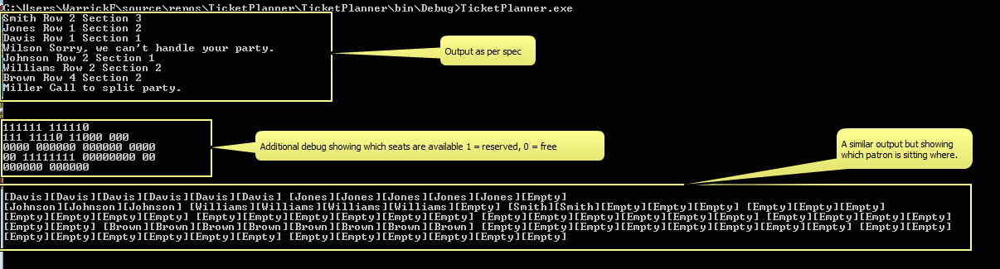

# Introduction

This project solves Problem 3: Theatre Seating as defined here: 

[a relative link](Design Problem - Set 2.md)

## Running the project 

Defined in the Main method is two variable, one named textFloorPlan and the other named textPatrons. In order to test different combinations, simply modify these variables. 


```csharp
            string textFloorPlan = @"6 6
3 5 5 3
4 6 6 4
2 8 8 2
6 6";
           

            string textPatrons = @"Smith 2
Jones 5
Davis 6
Wilson 100
Johnson 3
Williams 4
Brown 8
Miller 12";

            CinemaFloorPlan floorPlan = new CinemaFloorPlan(textFloorPlan);
            PreSaleCollection preSoldTickets = new PreSaleCollection(textPatrons);

            floorPlan.AllocatePreSaleSeating(preSoldTickets);

            preSoldTickets.Print(floorPlan);
```

## Example output




## Additional notes on logic. 

Most of the classes should be fairly self explanitory. The only two considerations are: 

1. When performing the seating assignment we seat the largest groups 1st as they will require large contiguous blocks of seating. 

2. We used Dictionaries to store the list of Sections in a row, seats in a section etc. this could probably have been avoided, using a simpler construct. 
